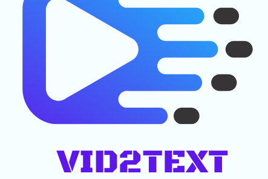

# Team HawkEye
## Winner of Best Use of AssemblyAI API category prize 🎉

  

  

#  📺  Vid2Text 📝 
**Vid2Text** is a platform that provides easy access to audio and video text transcription in one step. With the use of the cutting-edge technology of AssemblyAI, transcriptions are generated easily and efficiently.

## 💡INSPIRATION

With the introduction of online-based learning, a lot of video tutorials are being created for students and learners to gain knowledge. In as much as the idea is great, it is also limited in ways that might contain long hours of content and be inaccessible to some users. This is seen as a problem in the world today, that's why we built an innovative and creative solution  **Vid2Text** to provide the solution to this. It is a web application with easy access to audio and video text transcription for all types of users.

## 🍁About
Vid2Text is a web app that allows users to upload audio and video files with ease, which then generates Modified and Customized Audio and Video Transcriptions.
Some of the features it provides are:

### Features
- Automatically transcribe audio and video files with high accuracy. 
- Modified and Customized Audio and Video Transcriptions.
- Easy Keyword Search through Text
- Export Audio in Text Format.

## ⚙ Tools and Technology Used 👨‍💻
- Django
- HTML/CSS
- Python
- Assembly AI 
- Google Docs
## 🤼Team Members

- Aditya Goel [@adityagoel28](https://github.com/adityagoel28)
- Abiola Farounbi [@Abiola-Farounbi](https://github.com/Abiola-Farounbi)
- Flerovious [@flerovious](https://github.com/flerovious)

